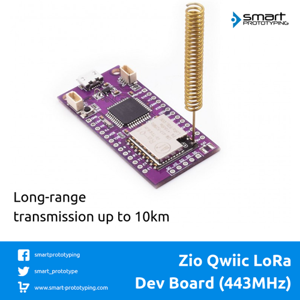

# Zio Qwiic LoRa Dev Board 443MHz

> This product can be available for purchase [here](https://www.smart-prototyping.com/Zio-Qwiic-LoRa-Dev-Board-443MHz).

#### Description

We know how complicated it is to connect LoRa module, so we make your ‘connecting’ life easier. We created an Arduino IDE compatible board which combines LoRa module + ATMEGA32U4-AU. Simply use two boards, one as a transmitter and another one as a receiver, and the LoRa setup is complete!

There are two Qwiic connectors on board, so you can add more Qwiic modules within seconds without soldering and jumper wire connection. 

The Main IC ATMEGA32U4-AU has almost the same performance as ATmega328, with built-in USB so not only does it have a USB-to-Serial program and debug capability built in with no need for an FTDI-like chip, it can also act like a mouse, keyboard, USB MIDI device, etc.
You can download the driver for ATMEGA32U4-AU [here](https://github.com/adafruit/Adafruit_Windows_Drivers/releases/download/1.2/adafruit_drivers.exe). Alternatively, you can check out the installation guide [here](https://learn.adafruit.com/adafruit-arduino-ide-setup/windows-driver-installation).

The LoRa module on board is based on SX1278 and works on a 433MHz frequency. It can work as master model or slave model. With a spring antenna, the communication distance can reach up to 10 KM in open field. It is a perfect solution for building projects that need to cross a big area. We offer two kinds of LoRa modules on board (optional), the Ra-01 with spring antenna and Ra-02 with IPX antenna. 

The onboard antenna is good enough for you to test function, if you need to implement it for real projects, please solder the antenna to get the best spreading distance.

> If you are looking for the Lora Module instead, you can find it [here](https://www.smart-prototyping.com/index.php?route=product/search&search=lora)

#### Specification

* Program Memory Size (KB): 32
* CPU Speed (MIPS/DMIPS): 16
* SRAM Bytes: 2,560
* Data EEPROM/HEF (bytes): 1024
* Wireless Standard: 433MHz
* Frequency range: 420 - 450MHz

#### Links

* [PCB source file and Gerber file](https://github.com/ZIOCC/Zio-Qwiic-LoRa-Dev-Board-434MHz)
* [Demo code](https://github.com/ZIOCC/Zio-Qwiic-LoRa-Dev-Board-434MHz/tree/master/arduino-LoRa-master)
* [ATMEGA32U4-AU datasheet](http://ww1.microchip.com/downloads/en/DeviceDoc/Atmel-7766-8-bit-AVR-ATmega16U4-32U4_Datasheet.pdf)
* [Arduino IDE Bootloader](https://github.com/adafruit/Adafruit_Windows_Drivers/releases/download/1.2/adafruit_drivers.exe)

###### About Zio
> Zio is a new line of open sourced, compact, and grid layout boards, fully integrated for Arduino and Qwiic ecosystem. Designed ideally for wearables, robotics, small-space limitations or other on the go projects. Check out other awesome Zio products [here](https://www.smart-prototyping.com/Zio).
